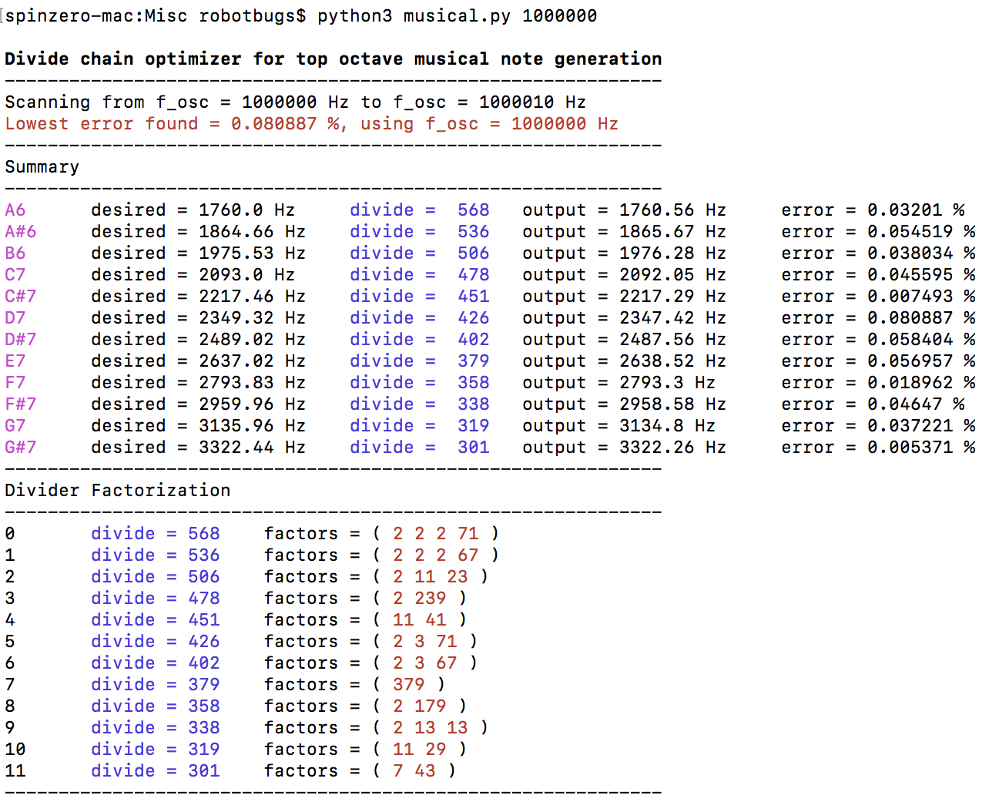

# Scripts
Python scripts for various purposes

## Divide Chain Optimizer for Top Octave Musical Note Generation

This is a python3 script to create a divider chain for a top-octave generator for a music synthesizer or instrument. The setup is that one master oscillator generates a frequency *f_osc* and this is then divided by 12 counters which use different divide ratios. The result is 12 lower frequencies that ideally have the same frequencies as all the semitone notes in an high octave on the piano. Lower octave notes can then be generated from these frequencie by divide by 2 stages.

The point of the script is that it allows you to optimize to find a set of divide ratios and master clock frequency for a desired level of pitch accuracy. For example one can ask it to search for master clock frequencies between 1.0MHz and 1.1MHz which when divided down produce the 12 note frequencies as accurately as possible. The code determines the ideal frequency and also the actual frequency synthesized and computes from the difference a percent error signal. It scans the available range of *f_osc* to find values that happen to minimize this error.

The code can also be used simply to find a set of divide ratios from a known clock source. The higher the frequency of the clock source, the more accurate the set of note frequencies will be, but on the other hand each divider chain will require more counter elements.

**Usage**

* `python3 musical.py f_osc` 
  - Print the divide ratios for the given master clock frequency.
* `python3 musical.py f_start f_end` 
  - Optimize to find the best clocking frequency in terms of minimum error over the desired range.
* `python3 musical.py f_start f_end octave` 
  - Optimize over the range to find the divide ratios for the given octave.

The default starting octave is 6 in which case the code runs from A6 through A7. Notes below A6 can be generated by dividing the frequency of the note one octave above by 2. The frequency of A6 = 1760Hz.

Below you can see an exampe output for a search between 1MHz and 1.01MHz, including the frequencies generated, which is followed by a factorization analysis of the divider chains:

## Calibrate
This script is for calibrating accelerometers and magnetometers. It works out the XYZ axis gain and offset based on a file containing a series of measurements. The measurement file is an ASCII file consisting of space separated X, Y, and Z axis readings, one per line. The only command line argument is the filename.

Gather the source data by turning the accelerometer around carefully to get a lot of readings of the normal gravity vector. The script assumes that the acceleration will be one g in some direction, so avoid shaking the sensor and introducing additional acceleration. Gather a few hundred readings taken over thirty seconds or so in various orientations. The same approach can be used with a magnetometer.

The script will perform a least squares fit to the data to get the best gain and offset values according to "reading = gain * accel + offset" for each axis.
